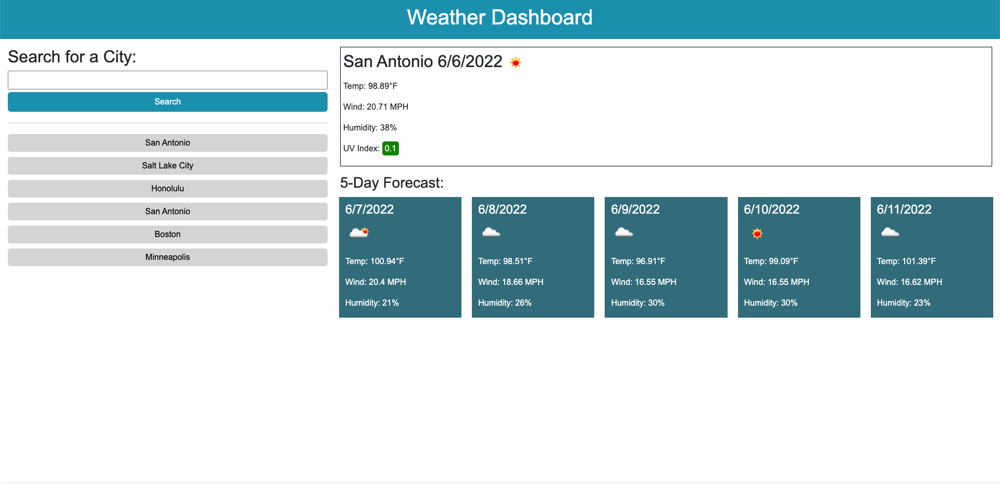

# Weather Dashboard

## Description
This is a simple weather dashboard that allows the user to search for a city and receive the current weather and the five-day forecast. The user can also view their previous city searches.

I approached this project thinking about "one step at a time." I coded my JavaScript functions to do one thing. 
- formSubmitHandler handles the search form. 
- getCoordinates uses the city entered by the user to get the latitude and longitude coordinates of that city from the API response. 
- getWeather gets the weather data from the API response using the coordinates. 
- renderCurrentResults prints the current weather conditions to the page. 
- renderDailyWeather prints the five-day forecast to the page.
- saveData saves the search to localStorage.
- renderSearchHistory prints previous city searches to the left side of the page.
- handleSearchHistory starts the process over with getCoordinates when the user clicks on one of the buttons for the previous cities searched.

Once I got the hang of working with the API, I enjoyed the process of finding the correct data in the response object. I felt like a detective. I also understood better how websites, in general, get information from one another. This week was a good step in my understanding of front-end web development.

One issue I encountered when doing this project was that a couple of my variables were in local scope when I needed them to be in the global scope. My tutor pointed out that this can be a tricky part of breaking down functions into doing one specific thing. It's something that I will be watching for in the future. 

An issue I need to work out in the future is that when a user enters random gibberish into the search query, that string of characters is logged into the search history but no data shows on the page.

Lastly, my tutor pointed out that there is a lag between when the user clicks the search button and when the data appears on the screen. If this project were to be on a bigger scale, that lag could be detrimental to the user's experience. 

## Installation
In order to access this repository, clone it from [GitHub](https://github.com/kaylab78/weather-dashboard) using the command "git clone git@github.com:kaylab78/weather-dashboard.git" in the command line interface.

Sign up for a free API key to OpenWeather [here](https://openweathermap.org/price).

## Usage
To view the deployed website, [click here](https://kaylab78.github.io/weather-dashboard/).

When the user opens the webpage, they are presented with an empty search query where they can type in a city. If they click the search button without entering any data, they are alerted and asked to enter a city name.

When the user enters a city into the search bar, they are presented with the current weather conditions and a five-day forecast. The UV Index is color coded to indicate the severity based on information from the World Health Organization.

When the user searches for a new city, their previous searches log into the search history on the left side of the page. The user can click on those previous searches to get the weather again.

## Credits
The [OpenWeather One Call API](https://openweathermap.org/api/one-call-api) is used in this project.

MDN contributors. (2022, April 25). *Date.prototype.toLocaleDateString().* MDN Web Docs. [https://developer.mozilla.org/en-US/docs/Web/JavaScript/Reference/Global_Objects/Date/toLocaleDateString](https://developer.mozilla.org/en-US/docs/Web/JavaScript/Reference/Global_Objects/Date/toLocaleDateString).

World Health Organization. (2017, October 16). *Radiation: The ultraviolet (UV) index.* World Health Organization. [https://www.who.int/news-room/questions-and-answers/item/radiation-the-ultraviolet-(uv)-index](https://www.who.int/news-room/questions-and-answers/item/radiation-the-ultraviolet-(uv)-index).

Thank you to bootcamp tutor Meg Meyers for helping me with saving the city searches to localStorage and retrieving that data.

The wording for the license on this project is from the MIT License outlined [here](https://choosealicense.com/licenses/mit/).

## License
Copyright (c) 2022 Kayla Backus

Permission is hereby granted, free of charge, to any person obtaining a copy of this software and associated documentation files (the "Software"), to deal in the Software without restriction, including without limitation the rights to use, copy, modify, merge, publish, distribute, sublicense, and/or sell copies of the Software, and to permit persons to whom the Software is furnished to do so, subject to the following conditions:

The above copyright notice and this permission notice shall be included in all copies or substantial portions of the Software.

THE SOFTWARE IS PROVIDED "AS IS", WITHOUT WARRANTY OF ANY KIND, EXPRESS OR IMPLIED, INCLUDING BUT NOT LIMITED TO THE WARRANTIES OF MERCHANTABILITY, FITNESS FOR A PARTICULAR PURPOSE AND NONINFRINGEMENT. IN NO EVENT SHALL THE AUTHORS OR COPYRIGHT HOLDERS BE LIABLE FOR ANY CLAIM, DAMAGES OR OTHER LIABILITY, WHETHER IN AN ACTION OF CONTRACT, TORT OR OTHERWISE, ARISING FROM, OUT OF OR IN CONNECTION WITH THE SOFTWARE OR THE USE OR OTHER DEALINGS IN THE SOFTWARE.